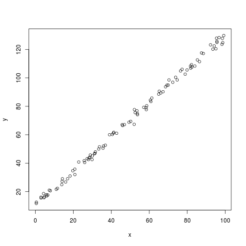

## Something Interesting


```r
x <- runif(100, min=0, max=100)
y <- 1.2*x + 10 + rnorm(length(x), sd=2)
plot(y ~ x)
```

 
1. Edit YAML front matter
2. Write using R Markdown
3. Use an empty line followed by three dashes to separate slides!

--- .class #id 

## Something Interesting


```r
x <- runif(100, min=0, max=100)
y <- -1.2*x + 10 + rnorm(length(x), sd=10)
plot(y ~ x)
```

 
1. Edit YAML front matter
2. Write using R Markdown
3. Use an empty line followed by three dashes to separate slides!

--- .class #id 

## Slide 3
 
La la la
